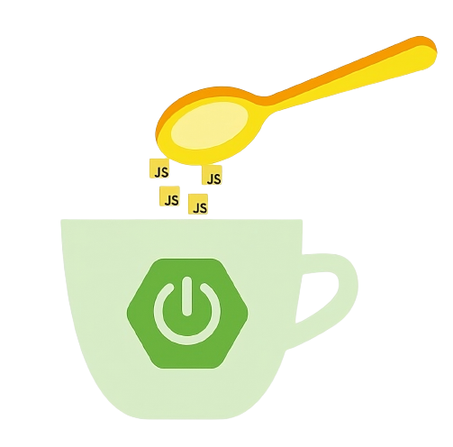

<p align="center">
  <a href="https://nestjs.com/" target="blank"></a>
</p>

<p align="center">Una CLI creada con <a href="https://nodejs.org" target="_blank">Node.js</a> para facilitar la construccion de proyectos de Spring Boot</p>
<p align="center">

## Descripción
JCUP es una aplicacion de linea de comando creada en javascript, la cual permite automatizar la construccion aplicaciones de java implementando el framework de Spring Boot.

JCUP  permite:
- Crear un proyecto (gestionado por gradle)
- Instalar dependencias
- Desinstalar dependencias
- Generar recursos
- Crear Dtos
- Gestionar conexiones a bases de datos
- Generar clientes web
- Implementar seguridad

Todo esto implementando una arquitectura por capas orientada al dominio.

## Instalacion
Para la instalacion se requiere nodejs version 14 o superiores.
```
  npm i jcup
```
## Creando un Proyecto Mediante JCUP
```
  jcup new name-proyect
```
seguido de esto el asitente le mostrará una serie de menus donde podra definir las caracteristica que usará en su proyecto a si como las tecnologias a implementar.

### Tipo de proyecto
podemos optar por construir un proyecto rest servlet totalmemte sincrono o implementar el paradigma de programacion reactiva utilizando webflux, jcup ajustará las dependencias y archivos en funcion del tipo seleccionado.


### Version de java
JCUP tambien le solicitará información acerca de la version de java a usar en el desarrollo del proyecto y poder seleccionar la version de Spring Boot y configuraciones adecuados para el proyecto.


### Motor de Base de Datos
Prodrá seleccionar una entre varias  opciones de motores de bases de datos, JCUP gestionará los drivers y conexiones segun las base de datos seleccionada.


### Integrar Docker Compose
Si la version de java seleccionada es java 17 o superior tendrá la opcion de integrar docker compose al proyecto. Si es afirmativo JCUP generará un archivo llamado docker-compose.yml y hará la instalacion de las dependencias para crear y conectarse a una base de datos en Docker de forma automática.  


acá un resumen de la creacion de un proyecto.


