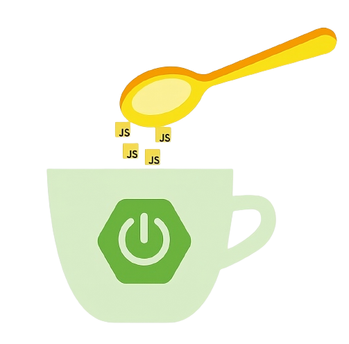

<p align="center">
  <a href="https://www.npmjs.com/package/jcup" target="blank"></a>
</p>

<p align="center">Una CLI creada con <a href="https://nodejs.org" target="blank">Node.js</a> para facilitar la construcción de proyectos de Spring Boot.</p>
<p align="center">

## Descripción
JCUP es una aplicación de línea de comando creada en JavaScript que permite automatizar la construcción de aplicaciones de Java implementando el framework Spring Boot.

JCUP  permite:
- Crear un proyecto (Gestionado por gradle).
- Instalar dependencias.
- Desinstalar dependencias.
- Generar recursos.
- Crear Dtos.
- Gestionar conexiones a bases de datos.
- Generar clientes Rest. 
- Implementar seguridad.
- Generar documentación.

Todo esto, implementando una arquitectura por capas orientada al dominio.

## Instalación
Para la instalación se requiere Node.js Version 14 o superiores.
```
  npm i -g jcup
```
## Creando un proyecto mediante JCUP.
```
  jcup new name-proyect
```
Seguido de esto, el asistente le mostrará una serie de menús donde podrá definir las características que usará en su proyecto, así como las tecnologías a implementar.

### Tipo de proyecto.
Podemos optar por construir un proyecto REST Servlet totalmemte síncrono o implementar el paradigma de programacion reactiva utilizando webflux.
JCUP ajustará las dependencias y archivos en función del tipo seleccionado.


### Version de Java.
JCUP también le solicitará información acerca de la version de Java a usar en el desarrollo del proyecto. Según esto, JCUP seleccionará la version de Spring Boot y hará las configuraciones adecuadas para el proyecto.


### Motor de base de datos.
Podrá seleccionar una entre varias  opciones de motores de bases de datos. JCUP gestionará los drivers y conexiones según las bases de datos seleccionadas.


### Integrar Docker Compose.
Si la version de Java seleccionada es Java 17 o superior tendrá la opcion de integrar Docker Compose al proyecto. Si es afirmativo, JCUP generará un archivo llamado "compose.yaml" y hará la instalación de las dependencias para crear y conectarse a una base de datos de Docker de forma automática.
Esto es bastante útil en la fase de desarrollo y poder abstraer todo el proceso de creación y conexión a una capa de persistencia. 


A continuación, el resumen de la creación de un proyecto.


### Estructura de paquetes.
JCUP generará el proyecto con dos paquetes bases. Un paquete **common** donde estarán las clases con funcionalidad común para los diferentes recursos que puedan existir en el proyecto, tales como manejo de excepciones y validadores.
Y el segundo paquete llamado **security** donde podremos aplicar la configuración a nivel de CORS de nuestro servidor. 
En la carpeta de resources se construirán tres archivos para manejar las propiedades de entorno de Spring Boot, para desarrollo y producción respectivamente.


## Generando un recurso.

```
  jcup generate resource name-resource
```
tambien podemos utilizar el shorthand:
```
  jcup g res name-resource
```
Se mostrará un asistente que le permitará seleccionar el tipo de estrategia de generación de claves primarias de la base de datos y si aplicará una auditoria a este recurso. Si selecciona que el recurso será auditable, JCUP implementará la configuración necesaria para agregar los campos de fecha de creación y fecha de actualización al recurso de forma automática.

  

  

Cuando generamos un recurso se creará un CRUD completo implementando una arquitectura de tres capas: controller, persitence y services. Puede observar en la imagen la inversion de dependencia entre la capa de persistencia y la  capa de servicio comparada con el modelo de capas tradicional, lo cual permite aislar la capa de servicio de cualquier detalle de implementación en la persitencia de datos.


**Nota**: Las flechas de la imagen representan las dependencias entre las capas, no el flujo de los datos.

Para un recurso llamado Product se mostrará la siguiente estructura.


### Capa controladora.
Esta contiene una clase con las anotaciones y los métodos necesarios para recibir las solictudes que provienen del cliente. Ademas tendrá el potencial para realizar validaciones a nivel de parámetros, si el caso de uso lo requiere.
Cuando el recurso es credo JCUP expone por defecto los endpoints en **api/v1/name-resource** en el puerto **3000**. si desea cambiar este comportaminto modifique el archivo aplication.yml.
De forma predeterminada y automática JCUP genera cinco endpoints para dicho recurso segun la tabla.

| Metodo   | Endpoint | Descripcion |
|----------|----------|:------------:|
| GET      | api/v1/resource?page=1&limit=10&orderBy=name |Obtenemos todos los recursos de forma paginada, los query params son opcionales |
| GET      | api/v1/resource/{id} |Obtenemos un recurso segun el id|
| POST     | api/v1/resource    |creamos un recurso segun los parametros pasados en el body de la solicitud|
| PATCH    | api/v1/resource/{id} |Actualizamos un recurso segun el id y las propiedades pasada en el cuerpo de la solicitud|
| DELETE   | api/v1/resource/{id} |eliminamos un registro de la base de datos segun el id|

### Capa de persistencia.

Esta capa posee dentro del paquete entities las definiciones de las entidades que este recurso almacenará en la base de datos, Los mappers para traducir los objetos tipo entidad a los objetos de tipo servicio (Dto). Además posee la implementación del repositorio, que fue definida en la capa de servicio.

### Capa de servicio.

Ésta posee la clase service que contiene los métodos que resuelven el caso de uso del recurso. Contiene toda la lógica que debe implementar el agregado. Tambien posee dentro del paquete dtos los objetos de datos necesarios para la comunicación entre capas. Además un convertidor de dtos cuya finalidad es convertir al dto de respuesta que espera el controlador.
de forma automática JCUP genera 5 métodos a nivel de servicio que resuelven las solicitudes para cada endpoint definido en la capa controladora.

## Flujo de datos.

JCUP usa el <a href="https://en.wikipedia.org/wiki/Data_mapper_pattern" target="_blank">patron data mapper</a> con el objetivo de no generar dependencias en la capa de servicio a cualquier implementación en la capa de persistencia.
Para implementar este patrón de forma eficiente, JCUP utiliza las librerias <a href="https://projectlombok.org/" target="_blank">Lombok</a> y <a target="_blank" href="https://mapstruct.org/">MapStruct</a>.

Aunque el proceso pareciera complejo, JCUP realiza todas las definiciones de los mappers para cada recurso generado, mientras que MapStruct se encarga de las implementaciones, dejando al desarrollador la tarea  de definir los  nombres de las propiedades y relaciones entre las entidades.


## Generando un Cliente Web

```
  jcup generate rest-client name-rest-client
```
tambien podemos utilizar el shorthand:
```
  jcup g rc name-rest-client
```
Los clientes REST generados se ubican en el paquete restClients dentro del paquete common. 
Todos los clientes Web generados por JCUP se extienden de la clase Azios presente en el paquete common que se creó a la hora de contruir el proyecto. La clase Azios varia en función del tipo de proyecto seleccionado, si es una aplicación tipo servlet esta será una interfaz con la definicion de los metodos de la libreria **open-feign**, mientras que si la aplicación es reactiva (web-flux), será una clase con la implementación de los metodos de la libreria **webClient** de web-flux.

Hay que ser cuidadoso de no inyectar  instancias de restClients en la capa de servicio, debido a que generariamos dependencias al protocolo comunicación HTTP en esta capa. La Arquitectura hexagonal plantea definir puertos y adaptadores que garantizen que la capa de servicio no dependa de ningun detalle de emplementacion, en este caso de la capa de infraestructura.


Los puertos deben ser agnosticos al protocolo de comunición, seran interfaces que definen los datos que se requiren de un servicio externo. Los adaptadores  implementaran estas interfaces y se valdrán de algún protocolo de comunicación para transferir los datos entre los servicios que se desean consumir y nuestra aplicación.

JCUP utiliza el patrón <a target="blank" href="https://en.wikipedia.org/wiki/Hexagonal_architecture_(software)">port adapter</a>  para aislar la capa de servicio de algún protocolo de comunicación en particular.

## Creando Puertos y Adaptadores

```
  jcup generate port-adapter name-resource/name-port
```
tambien podemos utilizar el shorthand:
```
  jcup g pa name-resource/name-port
```

Para implementar este patron JCUP generará un cliente rest  con el nombre dado en el comando, con la terminacion **RestClient**, creará un puerto (interfaz) con la terminacion **Port** en el paquete de servicio del recurso definido y una clase con la terminacion **Adapter** dentro del paquete  de communication.
El desarrollador podrá inyectar el puerto en el servicio del recuso sin generar dependencias. Realizar las implementaciones de los métodos en la clase adapter donde JCUP inyectó el cliente rest generado de forma automática.

## Generando Dtos

```
  jcup generate dto name-resource/name-dto
```
tambien podemos utilizar el shorthand:
```
  jcup g dto name-resource/name-dto
```
JCUP creará  un archivo con la terminación Dto con las anotaciones necesarias para que el desarrollador solo defina las propiedades que requiere para este nuevo objeto de transferencia.

Una herramienta adicional que JCUP ofrece para construir dtos, es generarlos a partir de un archivo JSON, el cual pude ser la respuesta que proviene de un servicio externo.  Debe asegurarse de tener esta respuesta copiada al clipboard, y ejecutar el comando:

```
  jcup generate json-to-dto name-resource/name-dto
```
tambien podemos utilizar el shorthand:
```
  jcup g jtd name-resource/name-dto
```
JCUP utiliza la libreria <a target="blank" href="https://quicktype.io/"> quicktype</a> para realizar el parseo y una vez obtenida la respuesta construirá los archivos que sean necesarios por usted.

## Agregando Seguridad

De froma predeterminada cuando creamos una aplicación con JCUP el unico filtro de seguridad que tiene habilitado son los CORS con su configuracion por defecto, por lo que bloqueará cualquier intento de ingreso desde un origen diferente al de la aplicacion.
En el paquete security, contamos con dos archivos **CorsConfig** y **SecurityConfig** para ajustar las caracteristicas de seguridad de la aplicación.
Dentro CorsConfig podemos agragar una lista de origenes y métodos a nivel global que serán permitidos.


### Autenticación y Autorización
Si el caso de uso de la aplicacion requiere un recurso que se encargué de autenticar y autorizar usuarios a nivel de roles podemos indicarlo en el mommento de crear dicho recurso agregando la badera --auth.

```
  jcup g res name-resource --auth
```
JCUP además de crear el recurso realizará las siguientes tareas:

1. Contruirá un recurso llamado role con una relación muchos a muchos con el recurso que acaba de crear.
2. actualizará el controlador y el servicio para permitir un proceso de login con basic-auth en el endpoint:

    name-resource/auth/login

3. Instalará la dependencia de java-jwt de Auth0
4. Creará e implementará un JwtFilter para proteger cada uno de los endpoints segun el token emitido en proceso de login.
Por defecto todos los endpoints creados No estarán protegidos. Según la lógica de negocio en el archivo SecurityConfig del paquete security podrá ajustar el nivel de seguridad que tendrá cada endpoint en función del role y el nivel de acceso de cada endpoint.

**Nota**
El JwtFilter y SecurityConfig creado dependerán del tipo de proyecto y versión de java seleccionada al momento de la construcción del mismo, por lo que habrá diferencias con relación a las clases y métodos utilizados, aunque en esencia la tarea de estos serán las mismas.
Ademas la key con la cual los token son firmados y  el tiempo de expiración  de estos pueden ser ajustado en las propiedades de entorno de spring.


## Manejo de Excepciones

JCUP incluye dentro del paquete common  un paquete llamado exceptions que posee las clases para realizar esta Tarea. La clase principal **HandlerException** tiene las anotaciones y métodos necesarios para interceptar cualquier tipo de excepción, clasificarla, formatearla y enviarla al cliente.
Ademas cuenta con un grupo excepcines personalizadas que pueden ser lanzadas dentro cualquier punto de nuestra aplicacion.

En la tabla se describe las excepciones personalizadas que estan incluidas en el paquete y disponibles para usar.

| Excepcion          | Descripcion |
|--------------------|--------------|
|BadRequestException |Envia un mensaje de error con codigo de estado 400 para indicar que la solicitud no cumple con el formato requerido|
|ConflictException | Envia un mensaje de error con el codigo de estado 409 para indicar alguna incosistencia durante el  procesamiento de la solicitud.|
|UnauthorizedException | Envia un mensaje de error con codigo de estado 401 para indicar que el usuario emisor de la solicitud no se encuentra autenticado en la aplicación. |
|ForbiddenException | Envia un mensaje de error con codigo de estado 403 para indicar que el usuario emisor de la solicitud aunque se encuentra autenticado no está autorizado para acceder al recurso.|
|NotFoundException | Envia un mensaje de error con codigo de estado 404 para indicar que el recurso solicitado no se encontró.|

**Nota** 
Cada una de las excepciones puede recibir un mensaje como parametro, el cual será formateado dentro de un mensaje de error y enviado al cliente.

## Documentación
JCUP ajustrá las dependencias para exponer de forma automática la documentación del proyecto mediante **swagger** en la siguiente URL:
http://localhost:3000/api/v1/doc/swagger-ui.html

Tenga encuenta que cuando se selecciona la configuración de producción esta característica estará deshabilitada.

## Instalacion de Dependencias